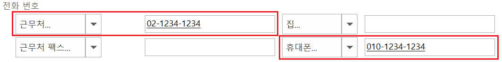

[Wox Launcher](http://www.getwox.com/)에서 입력한 이름을 아웃룩 연락처에서 찾아 전화번호를 바로 안내해주는 플러그인이다. C#으로 만들었다.

## 기능

* Wox에 2~4글자의 한글을 입력하면 한글이름으로 인식하여 아웃룩 연락처에서 휴대폰 전화번호와 근무처 전화번호를 검색하여 보여준다.

## 내려받기

* Wox Launcher에 "wpm install Outlook Contacts"을 입력하여 플러그인 설치한다.
 

* 혹 이렇게 설치가 되지 않는 경우에는 [Github에서 직접 최신 릴리즈를 다운](https://github.com/jihunroh/Wox.Plugin.OutlookContacts/releases/latest
)받아, Wox의 플러그인 디렉토리에 압축을 푼다.
Wox의 설정에서 플러그인을 활성화해야 사용할 수 있다.

## 주의점
* 오직 검색된 아웃룩 연락처의 휴대폰과 근무처 전화번호를 보여준다.

* 2~4글자의 한글만 이름으로 인식한다.

## 향후 추가할 기능
* 보여주는 필드를 임의로 설정하는 기능
* 4글자보다 긴 한글 이름과 영문 이름 등의 검색
* 초성 검색
